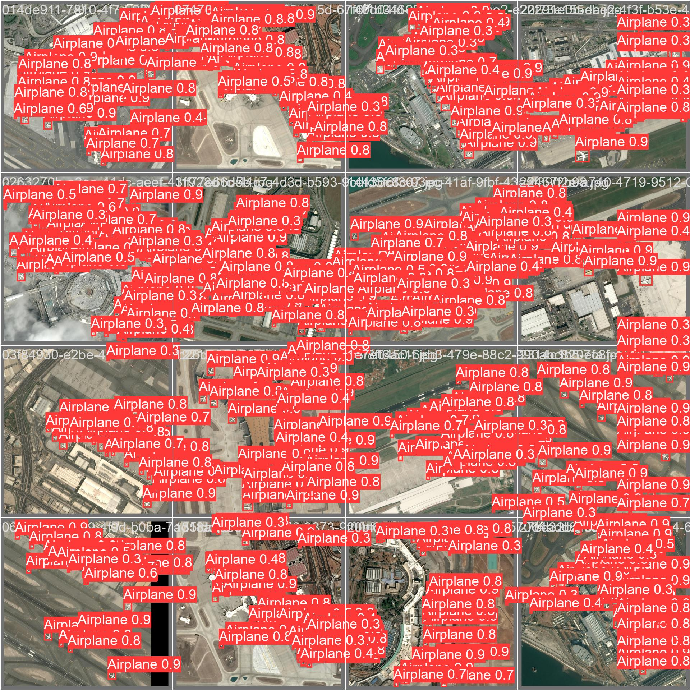

# AI-Powered Aircraft Detection in Satellite Imagery

## Project Overview
This project implements a custom computer vision model using **YOLOv5** to automatically detect and localize aircraft in satellite imagery. It serves as a proof-of-concept for automated aerial surveillance and airfield monitoring systems.

## Key Technologies
* **Python 3 & PyTorch:** Core development and deep learning framework.
* **YOLOv5:** State-of-the-art object detection architecture.
* **Computer Vision:** Custom data preprocessing to convert raw CSV annotations into normalized bounding box coordinates.
* **Google Colab (T4 GPU):** High-performance model training environment.

## Results
The model successfully identifies aircraft in test imagery, demonstrating the capability to handle varied orientations and density.

## How to Run
1. Open the `Aerial_Object_Recognition.ipynb` notebook in Google Colab.
2. Load the dataset (images and annotations).
3. Run the training cells to reproduce the results.
